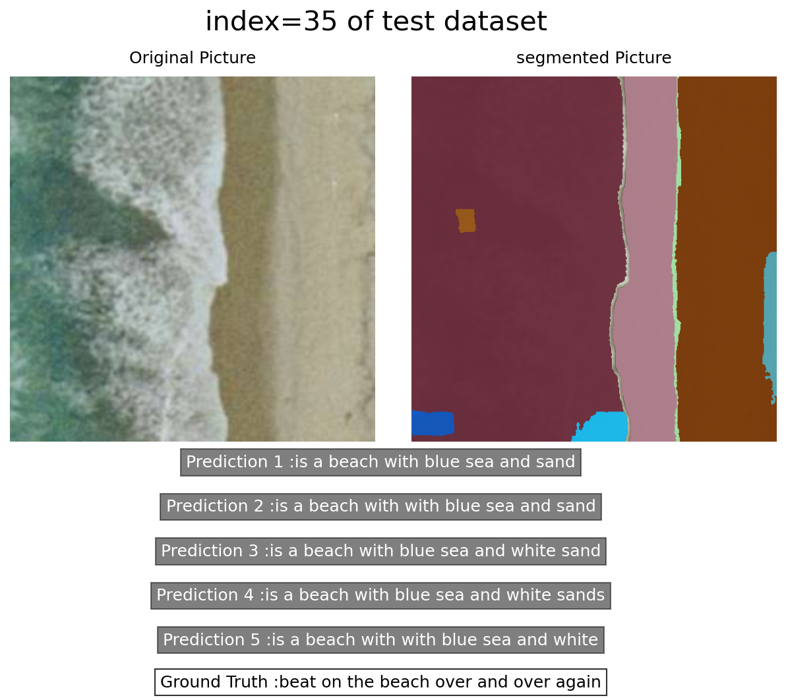
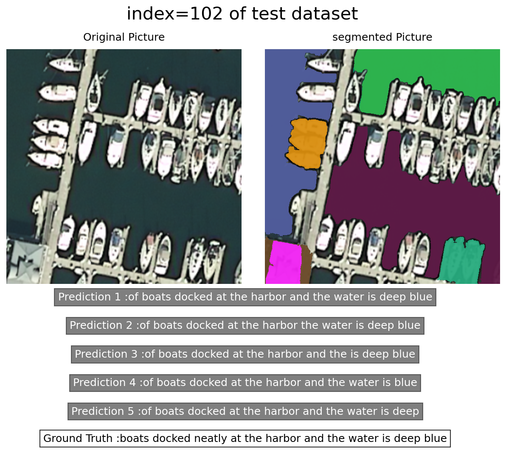
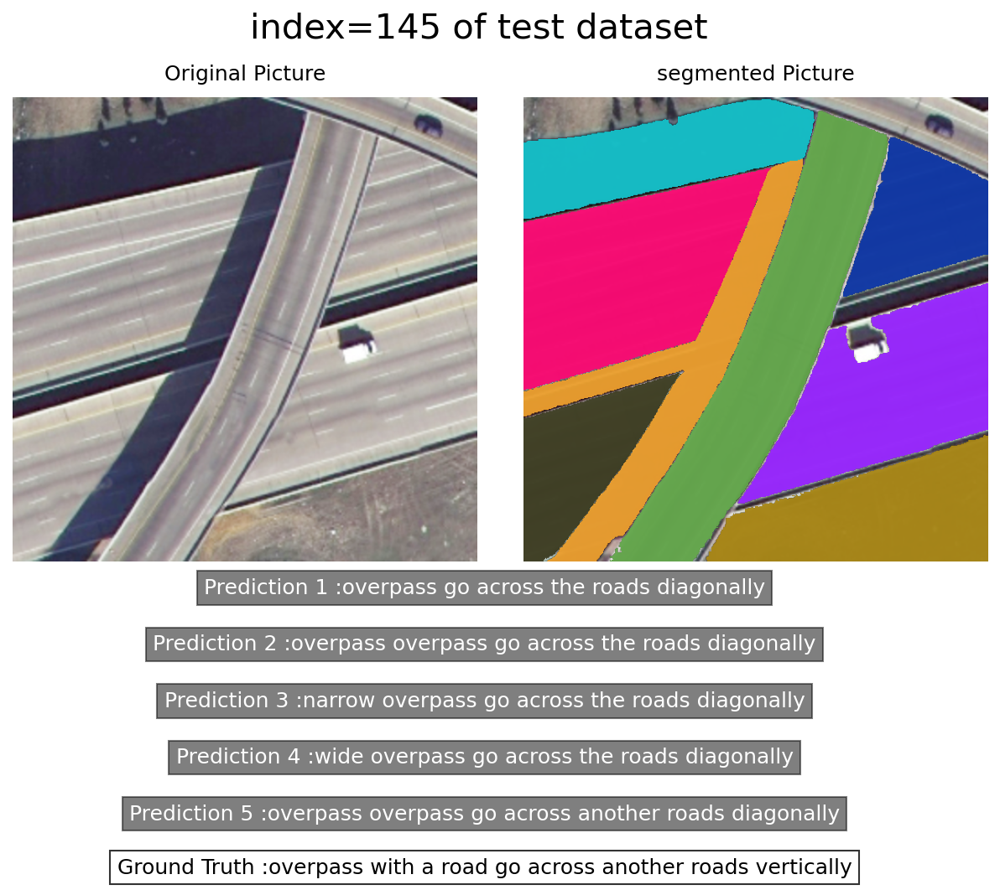
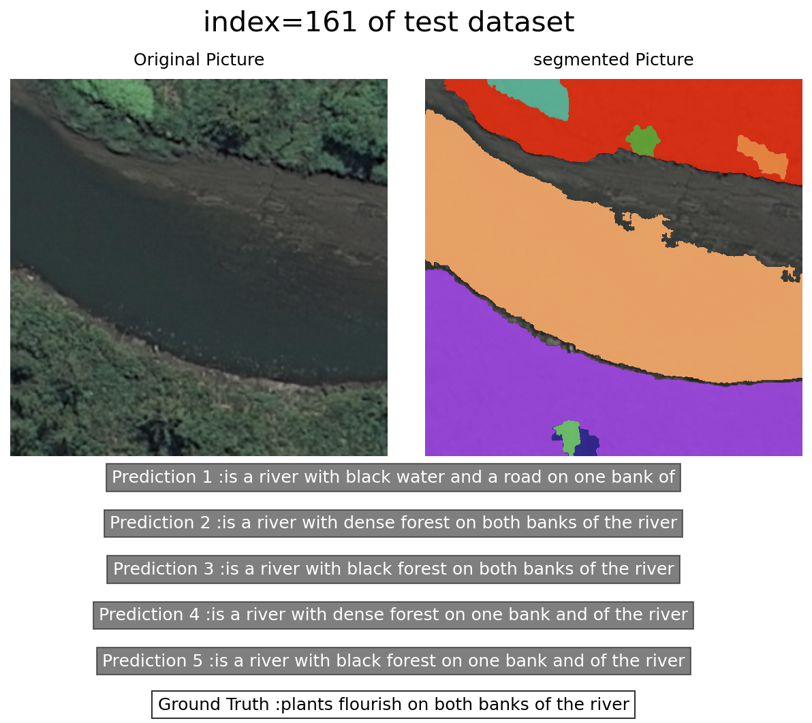

# Automatic Language Description Generation for Remote Sensing Images

**Project Description:**
<p align="center" width="100%">
     
</p>

Automatically generating language descriptions for remote sensing images has emerged as a significant research area within remote sensing. This project focuses on attention-based captioning methods, a prominent class of deep learning-based techniques for generating captions. These methods have the advantage of generating descriptive text while emphasizing the corresponding object locations within the image.

However, traditional attention-based approaches typically generate captions using coarse-grained and unstructured attention units. This limitation hinders the exploitation of structured spatial relationships within semantic content in remote sensing images. These images possess unique structural characteristics that differentiate them from natural images, posing greater challenges for remote sensing image captioning. Unfortunately, many existing remote sensing captioning methods draw inspiration from the computer vision community without considering domain-specific knowledge.

To address this challenge, we introduce a novel fine-grained, structured, attention-based method designed to leverage the inherent structural characteristics of semantic content in high-resolution remote sensing images. Our approach generates improved descriptions and produces pixel-wise segmentation masks for semantic content. Notably, this segmentation can be simultaneously trained with the captioning task within a unified framework, eliminating the need for pixel-wise annotations.

<p float="center">
  
   
</p>
<p float="center">
  
   
</p>

**Key Features:**

- Fine-grained, structured, attention-based captioning method.
- Utilization of spatial relationships within semantic content.
- Generation of pixel-wise segmentation masks for semantic content.
- Unified training framework for captioning and segmentation.
- Improved captioning accuracy compared to state-of-the-art methods.
- High-resolution and meaningful segmentation masks.

**Project Structure:**

The project directory structure is as follows:

- `config.yaml`: Configuration file for project settings.
- `deeplearning`: Directory containing deep learning-related code.
- `nets`: Neural network architectures and model definitions.
- `test.py`: Script for testing and evaluation.
- `dataloaders`: Data loading utilities.
- `losses`: Custom loss functions.
- `results`: Directory to store experiment results.
- `train.py`: Script for model training.
- `datasets`: Dataset handling and preprocessing.
- `models`: Trained model checkpoints.
- `SAM`: Structured Attention Mechanism implementation.
- `utils`: Utility functions and helper scripts.

**Getting Started:**

To begin working with this project, follow these steps:

1. Set up your Python environment with the required dependencies.
2. Configure the `config.yaml` file to adjust project settings.
3. Use the provided scripts for training (`train.py`), testing (`test.py`), and evaluation.
4. Explore the various directories for specific code components and functionalities.

**Evaluation:**

The proposed method has been extensively evaluated on three remote sensing image captioning benchmark datasets. The evaluation includes detailed ablation studies and parameter analyses. The results demonstrate that our approach outperforms state-of-the-art methods regarding captioning accuracy. Furthermore, our method's ability to generate high-resolution and meaningful segmentation masks adds significant value to the remote sensing image analysis pipeline.

**Contributing:**

Contributions to this project are welcome! If you want to improve the automatic language description generation for remote-sensing images, please submit pull requests or contact the project maintainers.

**License:**

This project is distributed under the [MIT License](LICENSE).

## Citation

If you find this work helpful or build upon it in your research, please consider citing the following paper:

```
[Yassin Riyazi, S. Mostaf Sajadi, Abas Zohrevand, and Reshad Hosseini*. 2024. "High Resolution Remote Sensing Image Captioning Based on Structured Attention Public." ICEE, 2024, Page Numbers. DOI]
```

**Acknowledgments:**

We acknowledge the support of the open-source community and the valuable insights gained from the remote sensing and computer vision domains. This project builds upon the collaborative spirit of knowledge sharing and technological advancement.

**Contact:**

For questions or inquiries, please contact [iyasiniyasin98@gmail.com](mailto:iyasiniyasin98@gmail.com).
